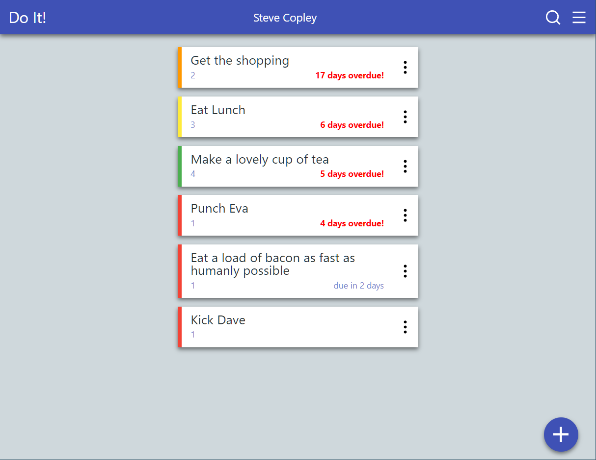
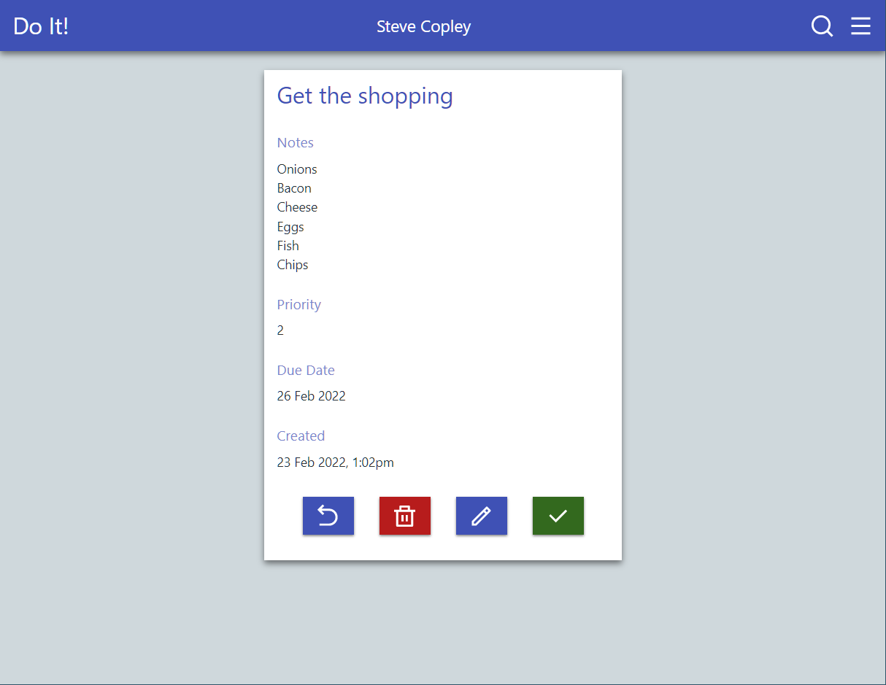
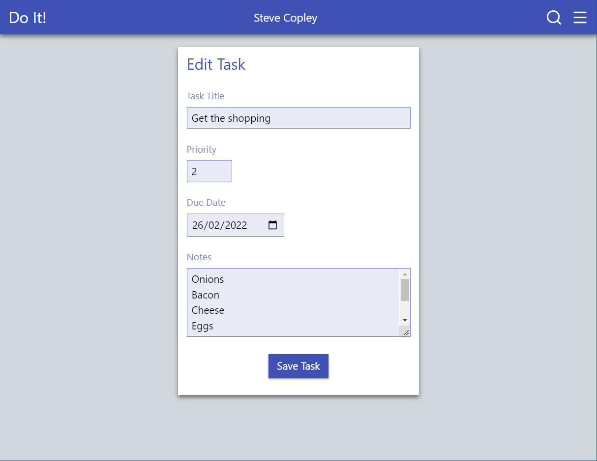
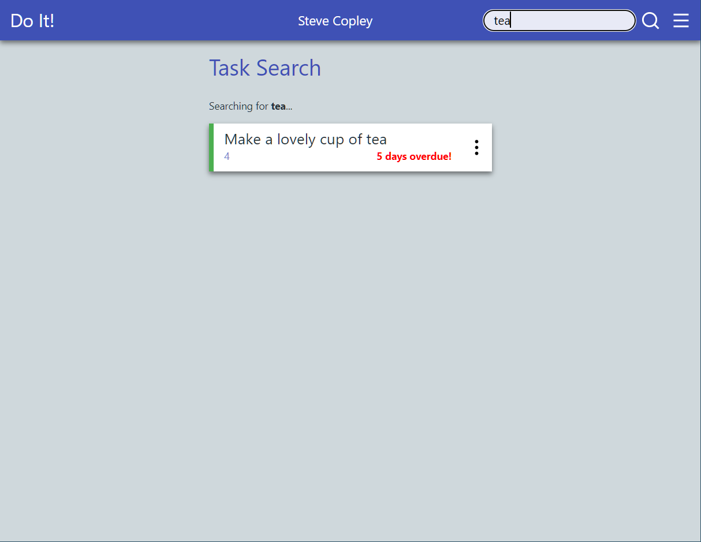
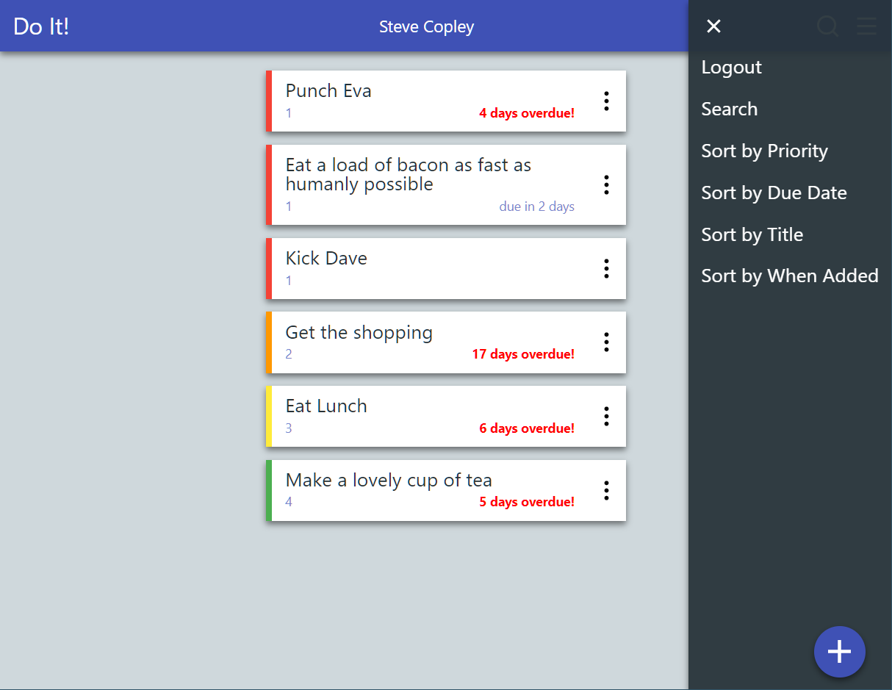

# Demo Project - To Do List

Demonstrates: 

- Creation of user accounts (with hashed & salted passwords)
- Logging in / out
- Use of session data
- Adaption of UI based on login status
- CRUD functionality:
   - Creation of new tasks
   - Reading of existing tasks
   - Updating tasks
   - Deletion of tasks
- Sorting of tasks by different criteria (via GET method)

Site has a simple but responsive UI, including:

- mobile-first design
- Use of dynamically added classes to highlight (late tasks, etc.)
- Header-based search form

## Screenshots

Task List

Task View

Task Edit

Search

Menu

